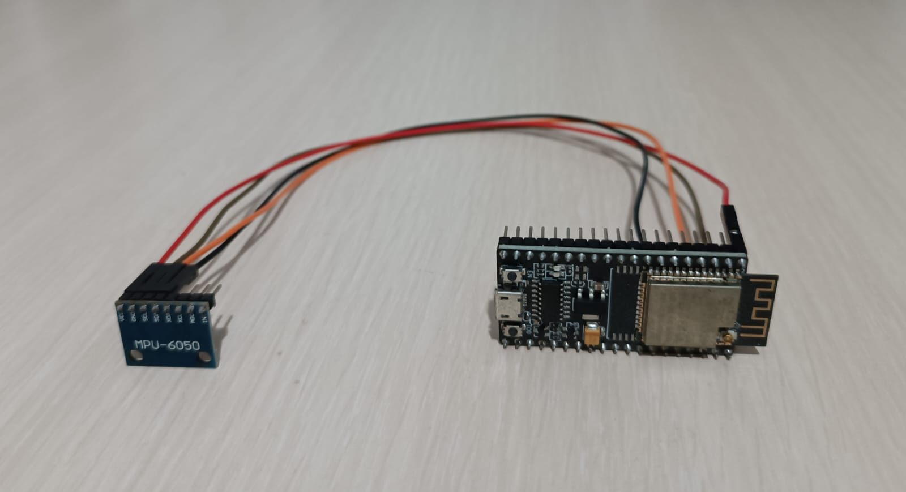
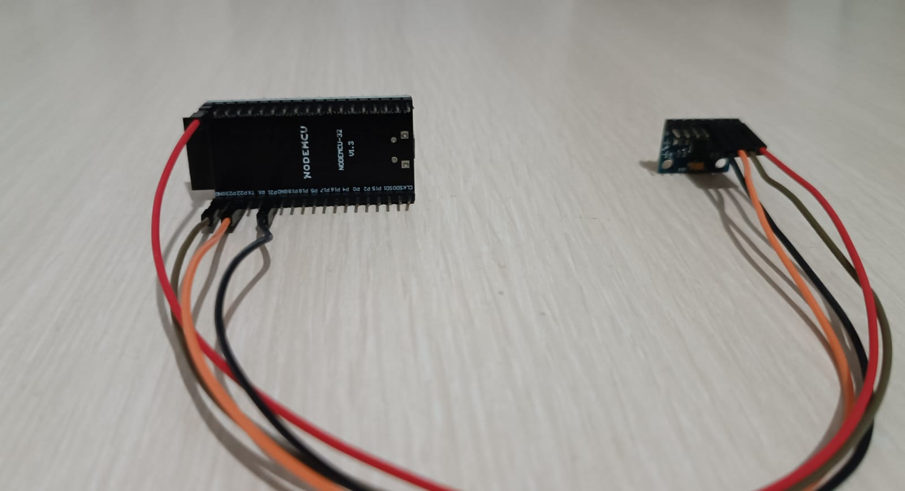
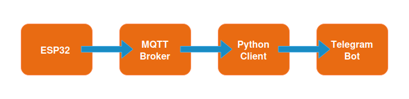

## ESP32 Earthquake Detection System

This project is a simple seismograph built using:
- ESP32
- MPU6050 accelerometer

  
  

---

Features:
- Motion detection
- MQTT data transmission
- Telegram bot alerts

Architecture:

  

